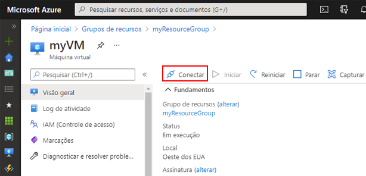
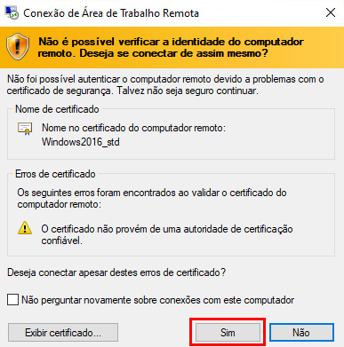
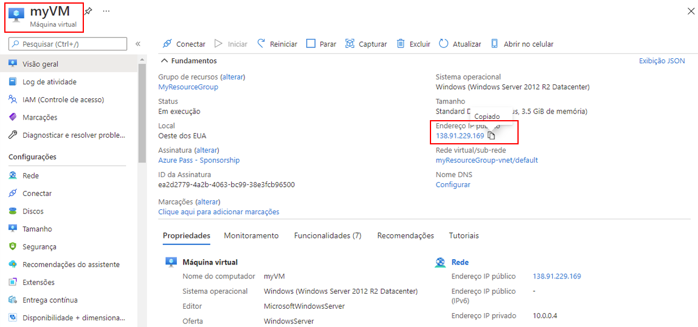
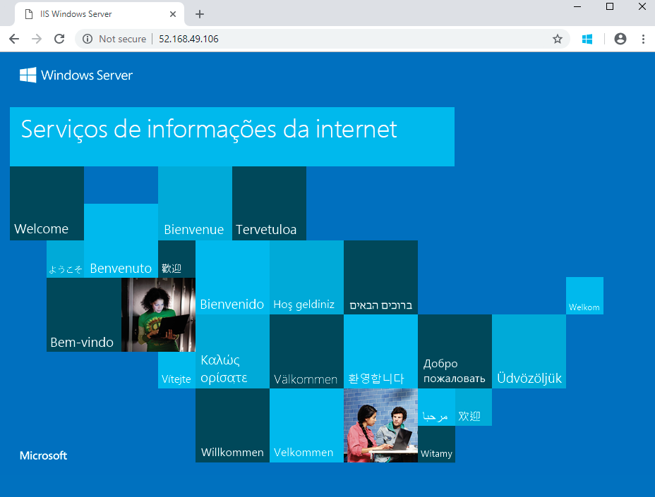

---
wts:
    title: '01 – Criar uma máquina virtual no portal (10 min)'
    module: 'Módulo 02 – Principais serviços do Azure (cargas de trabalho)'
---
# 01 – Criar uma máquina virtual no portal

Neste passo a passo, criaremos uma máquina virtual no portal do Azure, conectaremos à máquina virtual, instalaremos a função de servidor web e testaremos. 

**Observação**: Reserve um tempo durante este passo a passo para clicar e ler os ícones informativos. 

# Tarefa 1: Criar a máquina virtual (10 min)

Nesta tarefa, criaremos uma máquina virtual Windows Server 2019 Datacenter – 1ª geração. 

1. Entre no [portal do Azure (https://portal.azure.com)](https://portal.azure.com?azure-portal=true).

2. Na folha **Todos os serviços**, procure e selecione **Máquinas virtuais** e, em seguida, clique em **+ Adicionar** e escolha **+Máquina virtual**.

3. Na guia **Básico**, preencha as seguintes informações (mantenha os padrões para todo o resto):

    | Configurações | Valores |
    |  -- | -- |
    | Assinatura | **Escolha sua assinatura**|
    | Grupo de recursos | **myRGVM** (criar novo) |
    | Nome da máquina virtual | **myVm** |
    | Local | **(EUA) Leste dos EUA**|
    | Imagem | **Windows Server 2019 Datacenter – 1ª geração**|
    | Tamanho | Standard D2s v3|
    | Nome de usuário da conta de administrador | **azureuser** |
    | Senha da conta de administrador | **Pa$$w0rd1234**|
    | Regras de porta de entrada – Permitir as portas selecionadas | **RDP (3389)** e **HTTP (80)**|
    | | |

4. Mude para a guia Rede e procure **Selecionar as portas de entrada**:

    | Configurações | Valores |
    | -- | -- |
    | Selecionar as portas de entrada | **HTTP (80), RDP (3389)**|
    | | |

    **Observação** - Verifique se as portas 80 e 3389 estão selecionadas

5. Alterne para a guia Gerenciamento e, em sua seção **Monitoramento**, selecione a seguinte configuração:

    | Configurações | Valores |
    | -- | -- |
    | Diagnóstico de inicialização | **Desabilitar**|
    | | |

6. Mantenha os padrões restantes e clique no botão **Revisar + criar** na parte inferior da página.

7. Assim que a validação for aprovada, clique no botão **Criar**. Pode levar de cinco a sete minutos para implantar a máquina virtual.

8. Você receberá atualizações na página de implantação e por meio da área de **Notificações** (o ícone de sino no menu superior).

* **Verifique se as portas 80 e 3389 foram abertas**

# Tarefa 2: Conectar-se à máquina virtual

Nesta tarefa, vamos nos conectar à nossa nova máquina virtual usando RDP. 

1. Procure **myVM** e selecione sua nova máquina virtual.

    **Observação**: Você também pode usar o link **Ir para o recurso** na página de implantação ou o link para o recurso na área de **Notificação**.

2. Na folha **Visão geral** da máquina virtual, clique no botão **Conectar** e escolha **RDP**.

    

    **Observação**: As instruções a seguir mostram como se conectar à VM desde um computador Windows. Em um Mac, você precisa de um cliente RDP, como este Remote Desktop Client da Mac App Store; em um computador Linux, você pode usar um cliente RDP de software livre.

2. Na página **Conectar à máquina virtual**, mantenha as opções padrão para se conectar ao endereço IP público na porta 3389 e clique em **Baixar arquivo RDP**.

3. **Abra** o arquivo RDP baixado e clique em **Conectar** quando solicitado. 

    

4. Na janela **Segurança do Windows**, selecione **Mais opções** e, em seguida, **Usar uma conta diferente**. Forneça o nome de usuário (.\azureuser) e a senha (Pa$$w0rd1234). Clique em **OK** para conectar.

    

5. Você pode receber um aviso de certificado durante o processo de logon. Clique em **Sim** para criar a conexão e se conectar à VM implantada. Você deve se conectar com sucesso.

    

Parabéns! Você implantou e se conectou a uma máquina virtual do Windows Server no Azure

# Tarefa 3: Instalar a função de servidor Web e testar

Nesta tarefa, instale a função de servidor Web no servidor e certifique-se de que a página de boas-vindas padrão do IIS possa ser exibida.

1. Abra um prompt de comando do PowerShell na máquina virtual, clicando no botão **Iniciar**, digitando **PowerShell**, clicando com o botão direito do mouse em **Windows PowerShell** e selecionando **Executar como administrador** no menu do botão direito.

    

2. Instale o recurso **Web-Server** na máquina virtual executando o seguinte comando no prompt de comando do PowerShell. Você pode copiar e colar este comando.

    ```PowerShell
    Install-WindowsFeature -name Web-Server -IncludeManagementTools
    ```
  
3. Quando concluído, haverá um prompt informando **Success** com um valor **True**. Você não precisa reiniciar a máquina virtual para concluir a instalação. Feche a conexão do RDP com a VM.

    

4. De volta ao portal, navegue de volta para a folha **Visão geral** de myVM e, use o botão **Clique para área de transferência** para copiar o endereço IP público de myVM, abra uma nova guia do navegador, cole o endereço IP público na caixa de texto URL e pressione a chave **Enter** para navegar até ele.

    

5. A página de boas-vindas do servidor Web do IIS padrão será aberta.

    

Parabéns! Você criou um servidor Web que pode ser acessado por meio de seu endereço IP público. Se você tivesse um aplicativo Web para hospedar, poderia implantar arquivos de aplicativo na máquina virtual e hospedá-los para acesso público na máquina virtual implantada.


**Observação**: Para evitar custos adicionais, você pode remover este grupo de recursos. Procure grupos de recursos, clique em seu grupo de recursos e, em seguida, clique em **Excluir grupo de recursos**. Verifique o nome do grupo de recursos e clique em **Excluir**. Monitore as **Notificações** para verificar se a exclusão foi concluída com êxito. 
