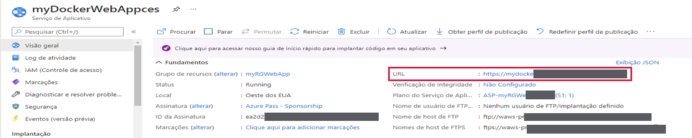
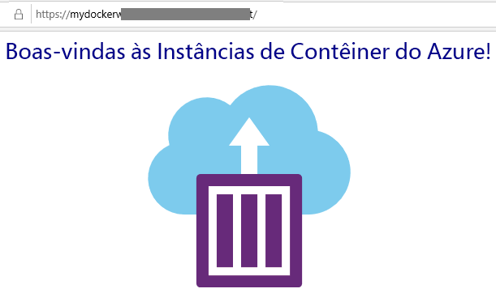

---
wts:
    title: '02 – Criar um aplicativo Web (10 min)'
    module: 'Módulo 02 – Principais serviços do Azure (cargas de trabalho)'
---
# 02 – Criar um aplicativo Web

Neste passo a passo, criaremos um novo aplicativo Web que executa um contêiner do Docker. O contêiner exibe uma mensagem de boas-vindas. 

# Tarefa 1: Criar um aplicativo Web (10 min)

O Serviço de Aplicativo do Azure é, na verdade, uma coleção de quatro serviços, todos compilados para ajudá-lo a hospedar e executar aplicativos Web. Os quatro serviços (aplicativos Web, aplicativos móveis, aplicativos de API e aplicativos lógicos) parecem diferentes, mas no final todos operam de maneiras muito semelhantes. Os aplicativos Web são os mais comumente usados dos quatro serviços, e este é o serviço que usaremos neste laboratório.

Nesta tarefa, você criará um Aplicativo Web do Serviço de Aplicativo do Azure. 

1. Entre no [portal do Azure](http://portal.azure.com/). 

2. Na folha **Todos os serviços**, procure e selecione **Serviços de aplicativos** e clique em **+ Adicionar, + Criar ou + Novo**

3. Na guia **Básico** da folha **Aplicativo Web**, especifique as seguintes configurações (substitua **xxxx** no nome do aplicativo Web por letras e dígitos de forma que o nome seja globalmente exclusivo). Mantenha os padrões para todo o resto, incluindo o Plano do Serviço de Aplicativo. 

    | Configuração | Valor |
    | -- | -- |
    | Assinatura | **escolha sua assinatura** |
    | Grupo de Recursos | **myRGWebApp1** (criar novo) |
    | Nome | **myDockerWebAppxxxx** |
    | Publicar | **Contêiner do Docker** |
    | Sistema Operacional | **Linux** |
    | Região | **Leste dos EUA** (ignore todos os avisos de disponibilidade do plano de serviço) |
    | | |	
    
    **Observação** - Lembre-se de alterar o **xxxx** para que tenha um **Nome** exclusivo

4. Clique em **Avançar > Docker** e configure as informações do contêiner. O comando de inicialização é opcional e não é necessário neste exercício. 

    **Observação:** Este é o mesmo contêiner usado no passo a passo Instâncias de Contêiner para exibir uma mensagem Olá, Mundo. 

    | Configuração | Valor |
    | -- | -- |
    | Opções | **Contêiner único** |
    | Origem da imagem | **Docker Hub** |
    | Tipo de acesso | **Público** |
    | Imagem e marca | **microsoft/aci-helloworld** |
    | | |	

5. Clique em **Revisar + criar** e, em seguida, clique em **Criar**. 

# Tarefa 2: Testar o aplicativo Web

Nesta tarefa, testaremos o aplicativo Web.

1. Aguarde a implantação do aplicativo Web.

2. Em **Notificações**, clique em **Ir para o recurso**. 

3. Na folha **Visão geral**, localize a entrada **URL**. 

    

4. Clique no **URL** para abrir a nova guia do navegador e exibir a página Bem-vindo às Instâncias de Contêiner do Azure.

    

5. Volte para a folha **Visão geral** do seu aplicativo Web e observe que ela inclui vários gráficos. Se você repetir a etapa 4 algumas vezes, deverá ser capaz de ver a telemetria correspondente sendo exibida nos gráficos. Isso inclui o número de solicitações e o tempo médio de resposta. 

**Observação**: Para evitar custos adicionais, você pode remover este grupo de recursos. Procure grupos de recursos, clique em seu grupo de recursos e, em seguida, clique em **Excluir grupo de recursos**. Verifique o nome do grupo de recursos e clique em **Excluir**. Monitore as **Notificações** para ver como a exclusão está ocorrendo.

