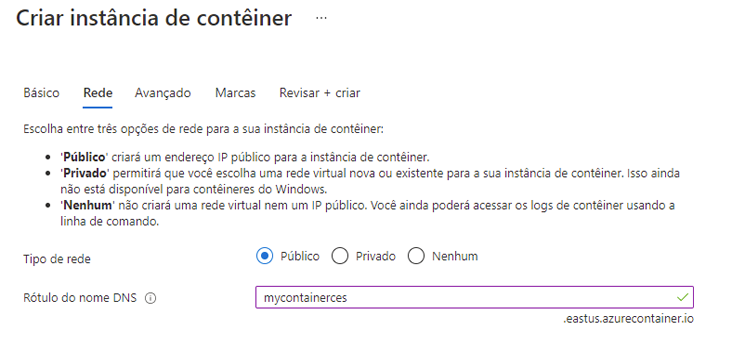

---
wts:
    title: '03 – Implantar Instâncias de Contêiner do Azure (10 min)'
    module: 'Módulo 02 – Principais serviços do Azure (cargas de trabalho)'
---

# 03 – Implantar Instâncias de Contêiner do Azure

Neste passo a passo, criamos, configuramos e implantamos um contêiner do Docker usando Instâncias de Contêiner do Azure (ACI) no portal do Azure. O contêiner é um aplicativo Web Bem-vindo à ACI que exibe uma página HTML estática. 

# Tarefa 1: Criar uma instância de contêiner (10 min)

Nesta tarefa, criaremos uma nova instância de contêiner para o aplicativo Web. 

1. Entre no [portal do Azure](https://portal.azure.com).

2. Na folha **Todos os serviços**, procure e selecione **Instâncias de contêiner** e clique em **+ Adicionar, + Criar ou + Novo**. 

3. Forneça os seguintes detalhes básicos para a nova instância de contêiner (mantenha os padrões para todo o resto): 

	| Configuração| Valor|
	|----|----|
	| Assinatura | **escolha sua assinatura** |
	| Grupo de recursos | **myRGContainer** (criar novo) |
	| Nome do contêiner| **mycontainer**|
	| Região | **(EUA) Leste dos EUA** |
	| Origem da imagem| **Docker Hub ou outro registro**|
	| Tipo de imagem| **Público**|
	| Imagem| **microsoft/aci-helloworld**|
	| Tipo de OS| **Linux** |
	| Tamanho| ***Mantenha o padrão***|
	|||

4. Configure a guia Rede (substitua **xxxx** por letras e dígitos de forma que o nome seja globalmente exclusivo). Mantenha todas as outras configurações com seus valores padrão.

	| Configuração| Valor|
	|--|--|
	| Etiqueta de nome DNS| **mycontainerdnsxxxx** |
	|||
	
	**Observação**: Seu contêiner estará publicamente acessível em dns-name-label.region.azurecontainer.io. Se você receber uma mensagem de erro **Etiqueta do nome DNS não disponível** após a implantação, especifique uma etiqueta de nome DNS diferente (não use xxxx) e reimplante. 

	

5. Clique em **Revisar e criar** para iniciar o processo de validação automática.

6. Clique em **Criar** para criar a instância de contêiner. 

7. Monitore a página de implantação e a página de **Notificações**. 

8. Enquanto espera, você pode estar interessado em visualizar o [código de exemplo por trás deste aplicativo simples](https://github.com/Azure-Samples/aci-helloworld). Navegue na pasta \app. 

# Tarefa 2: Verificar a implantação da instância de contêiner

Nesta tarefa, verificamos se a instância de contêiner está em execução, garantindo que a página de boas-vindas seja exibida.

1. Após a conclusão da implantação, clique no link **Ir para o recurso** na folha de implantação ou no link para o recurso na área de Notificação.

2. Na folha **Visão geral** de **mycontainer**, certifique-se de que o **Status** do seu contêiner seja **Em execução**. 

3. Localize o nome de domínio totalmente qualificado (FQDN).

	

2. Copie o FQDN do contêiner no navegador Web da caixa de texto do URL e pressione **Enter**. A página de boas-vindas deve ser exibida. 

	

**Observação**: Você também pode usar o endereço IP do contêiner em seu navegador. 

Parabéns! Você usou o portal do Azure para implantar com êxito um aplicativo em um contêiner na Instância de Contêiner do Azure.

**Observação**: Para evitar custos adicionais, você pode remover este grupo de recursos. Procure grupos de recursos, clique em seu grupo de recursos e, em seguida, clique em **Excluir grupo de recursos**. Verifique o nome do grupo de recursos e clique em **Excluir**. Monitore as **Notificações** para ver como a exclusão está ocorrendo.
