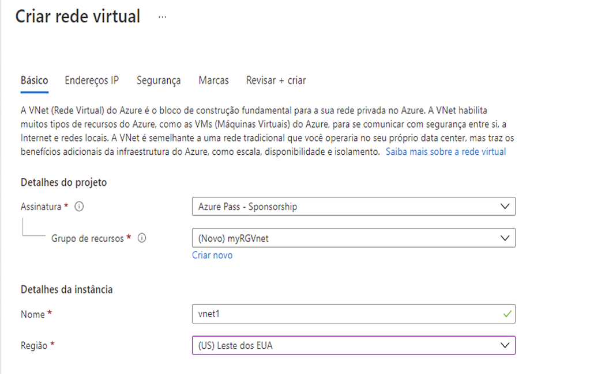
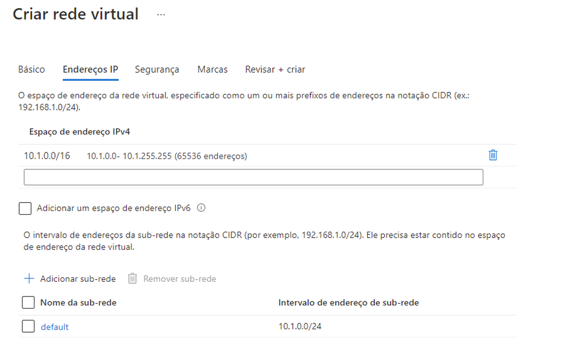

---
wts:
    title: '04 – Criar uma rede virtual (20 min)'
    module: 'Módulo 02 – Principais serviços do Azure (cargas de trabalho)'
---
# 04 – Criar uma rede virtual

Neste passo a passo, vamos criar uma rede virtual, implantar duas máquinas virtuais nessa rede e, em seguida, permitir que uma máquina virtual execute ping na outra dentro dessa rede virtual.

# Tarefa 1: Criar uma rede virtual (20 min)

Nesta tarefa, você criará uma rede virtual. 

1. Entre no portal do Azure em <a href="https://portal.azure.com" target="_blank"><span style="color: #0066cc;" color="#0066cc">https://portal.azure.com</span></a>

2. Na folha **Todos os serviços**, procure e selecione **Máquinas virtuais** e, em seguida, clique em **+ Adicionar, + Criar ou + Novo**. 

3. Na folha **Criar rede virtual**, preencha o seguinte (mantenha os padrões para todo o resto):

    | Configuração | Valor | 
    | --- | --- |
    | Assinatura | **Selecionar sua assinatura** |
    | Grupo de recursos | **myRGVNet** (criar novo) |
    | Nome | **vnet1** |
    | Local | **(EUA) Leste dos EUA** |
    | Espaço de endereço |**10.1.0.0/16** |
    | Sub-rede – Nome | **default** |
    | Intervalo de endereços da sub-rede | **10.1.0.0/24** |

    
    

5. Clique no botão **Revisar + criar**. Certifique-se de que a validação seja aprovada.

6. Clique no botão **Criar** para implantar a rede virtual. 

    **Observação**: Em sua organização, como você saberá de quais redes virtuais e endereços IP precisará?

# Tarefa 2: Criar duas máquinas virtuais

Nesta tarefa, criaremos duas máquinas virtuais na rede virtual. 

1. Na folha **Todos os serviços**, procure **Máquinas virtuais** e, em seguida, clique em **+ Adicionar** e escolha **+Máquina virtual**. 

2. Na guia **Básico**, preencha as seguintes informações (mantenha os padrões para todo o resto):

   | Configuração | Valor | 
   | --- | --- |
   | Assinatura | **escolha sua assinatura**  |
   | Grupo de recursos |  **myRGVNet** |
   | Nome da máquina virtual | **vm1**|
   | Região | **(EUA) Leste dos EUA** |
   | Imagem | **Windows Server 2019 Datacenter** |
   | Nome do usuário| **azureuser** |
   | Senha| **Pa$$w0rd1234** |
   | Portas de entrada públicas| Selecione **Permitir as portas selecionadas**  |
   | Portas de entrada selecionadas| **RDP (3389)** |
   |||

3. Selecione a guia **Rede**. Certifique-se de que a máquina virtual seja colocada na rede virtual vnet1. Revise as configurações padrão, mas não faça nenhuma outra alteração. 

   | Configuração | Valor | 
   | --- | --- |
   | Rede virtual | **vnet1** |
   |||

4. Clique em **Revisar + criar**. Após a validação passar, clique em **Criar**. O tempo de implantação pode variar, mas geralmente pode levar de três a seis minutos para ser concluído.

5. Monitore sua implantação, mas continue na próxima etapa. 

6. Crie uma segunda máquina virtual repetindo as etapas **2 a 4** acima. Certifique-se de usar um nome de máquina virtual diferente, que a máquina virtual esteja dentro da mesma rede virtual e esteja usando um novo endereço IP público:

    | Configuração | Valor |
    | --- | --- |
    | Grupo de recursos | **myRGVNet** |
    | Nome da máquina virtual |  **vm2** |
    | Rede virtual | **vnet1** |
    | IP público | (novo) **vm2-ip** |
    |||

7. Aguarde a implantação de ambas as máquinas virtuais. 

# Tarefa 3: Testar a conexão 

Nesta tarefa, permitiremos o logon em uma VM e o ping na outra. 

1. Na folha **Todos os recursos**, procure **vm1**, abra sua folha **Visão geral** e certifique-se de que seu **Status** seja **Em execução**. Pode ser necessário **Atualizar** a página.

2. Na folha **Visão geral**, clique no botão **Conectar**.

    **Observação**: As instruções a seguir mostram como se conectar à VM desde um computador Windows. 

3. Na folha **Conectar à máquina virtual**, mantenha as opções padrão para se conectar ao endereço IP na porta 3389 e clique em **Baixar arquivo RDP**.

4. Abra o arquivo RDP baixado e clique em **Conectar** quando solicitado. 

5. Na janela **Segurança do Windows**, digite o nome de usuário **azureuser** e a senha **Pa$$w0rd1234** e clique em **OK**.

6. Você pode receber um aviso de certificado durante o processo de logon. Clique em **Sim** para criar a conexão e se conectar à VM implantada. Você deve se conectar com sucesso.

7. Abra um prompt de comando do PowerShell na máquina virtual, clicando no botão **Iniciar**, digitando **PowerShell**, clicando com o botão direito do mouse em **Windows PowerShell** no menu do botão direito e clicando em **Executar como administrador**

8. No Powershell, digite o seguinte comando para tentar se comunicar com vm2, você notará que teve sucesso.

   ```PowerShell
   ping vm2
   ```

Parabéns! Você configurou e implantou duas máquinas virtuais em uma rede virtual. E você testou que pode se comunicar entre as duas VMs. 

**Observação**: Para evitar custos adicionais, você pode remover este grupo de recursos. Procure grupos de recursos, clique em seu grupo de recursos e, em seguida, clique em **Excluir grupo de recursos**. Verifique o nome do grupo de recursos e clique em **Excluir**. Monitore as **Notificações** para ver como a exclusão está ocorrendo.
