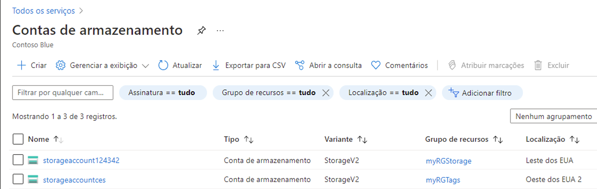
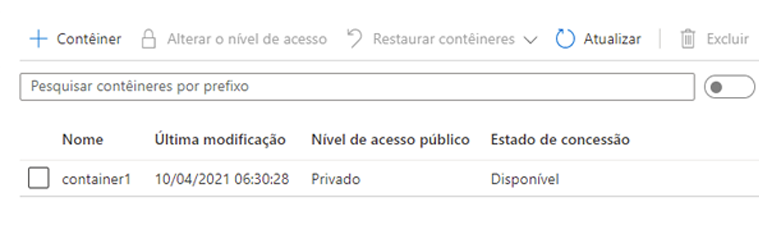

---
wts:
    title: '05 – Criar armazenamento de blobs (5 min)'
    module: 'Módulo 02 – Principais serviços do Azure (cargas de trabalho)'
---
# 05 – Criar armazenamento de blobs

Neste passo a passo, criaremos uma conta de armazenamento e, em seguida, trabalharemos com arquivos de armazenamento de blobs.

# Tarefa 1: Criar uma conta de armazenamento (5 min)

Nesta tarefa, criaremos uma nova conta de armazenamento. 

1. Entre no portal do Azure em <a href="https://portal.azure.com" target="_blank">https://portal.azure.com</a>

2. Na folha **Todos os serviços**, procure e selecione **Contas de armazenamento** e, em seguida, clique em **+ Adicionar, + Criar ou + Novo**. 

3. Na guia **Básico** da folha **Criar conta de armazenamento**, preencha as seguintes informações (substitua **xxxx** no nome da conta de armazenamento por letras e dígitos de forma que o nome seja globalmente exclusivo). Mantenha os padrões para todo o resto.

    | Configuração | Valor | 
    | --- | --- |
    | Assinatura | **escolha sua assinatura** |
    | Grupo de recursos | **myRGStorage** (criar novo) |
    | Nome da conta de armazenamento | **storageaccountxxxx** |
    | Local | **(EUA) Leste dos EUA**  |
    | Desempenho | **Standard** |
    | Tipo de conta | **StorageV2 (v2 de uso geral)** |
    | Replicação | **LRS (armazenamento com redundância local)** |
    | | |

    **Observação** - Lembre-se de alterar o **xxxx** para que tenha um **Nome de conta de armazenamento** exclusivo

5. Clique em **Revisar + Criar** para revisar as configurações da sua conta de armazenamento e permitir que o Azure valide a configuração. 

6. Depois de validado, clique em **Criar**. Aguarde a notificação de que a conta foi criada com sucesso. 

7. Na página inicial, procure e selecione **Contas de armazenamento** e certifique-se de que sua nova conta de armazenamento esteja listada.

    

# Tarefa 2: Trabalhar com armazenamento de blobs

Nesta tarefa, criaremos um contêiner de blob e carregaremos um arquivo de blob. 

1. Clique no nome da nova conta de armazenamento, role até a seção **Serviço Blob** e, em seguida, clique em **Contêineres**.

2. Clique em **+ Contêiner** e preencha as informações. Use os ícones de informações para saber mais. Quando terminar, clique em **Criar**.

    | Configuração | Valor |
    | --- | --- |
    | Nome | **container1**  |
    | Nível de acesso público| **Privado (sem acesso anônimo)** |
    | | |

    

4. Clique no contêiner **container1** e, em seguida, clique em **Carregar**.

5. Navegue até um arquivo em seu computador local. 

    **Observação**: Você pode criar um arquivo `.txt` vazio ou usar qualquer arquivo existente. Considere escolher um arquivo de tamanho pequeno para minimizar o tempo de upload.

6. Clique na seta **Avançado**, deixe os valores padrão, mas revise as opções disponíveis e clique em **Carregar**.

    **Observação**: Você pode carregar quantos blobs quiser dessa maneira. Novos blobs serão listados no contêiner.

7. Assim que for carregado, clique com o botão direito do mouse no arquivo e observe as opções, incluindo Exibir/Editar, Baixar, Propriedades e Excluir. 

8. Conforme você tiver tempo, na folha da conta de armazenamento, revise as opções para Arquivos, Tabelas e Filas.

# Tarefa 3: Monitorar a conta de armazenamento

1. Se necessário, volte para a folha da conta de armazenamento e clique em **Diagnosticar e resolver problemas**. 

2. Explore alguns dos problemas de armazenamento mais comuns. Observe que há vários solucionadores de problemas.

3. Na folha da conta de armazenamento, role para baixo até a seção **Monitoramento** e clique em **Insights**. Observe que há informações sobre Falhas, Desempenho, Disponibilidade e Capacidade. Suas informações serão diferentes.

    

Parabéns! Você criou uma conta de armazenamento e, em seguida, trabalhou com blobs de armazenamento.

**Observação**: Para evitar custos adicionais, você pode remover este grupo de recursos. Procure grupos de recursos, clique em seu grupo de recursos e, em seguida, clique em **Excluir grupo de recursos**. Verifique o nome do grupo de recursos e clique em **Excluir**. Monitore as **Notificações** para ver como a exclusão está ocorrendo.
