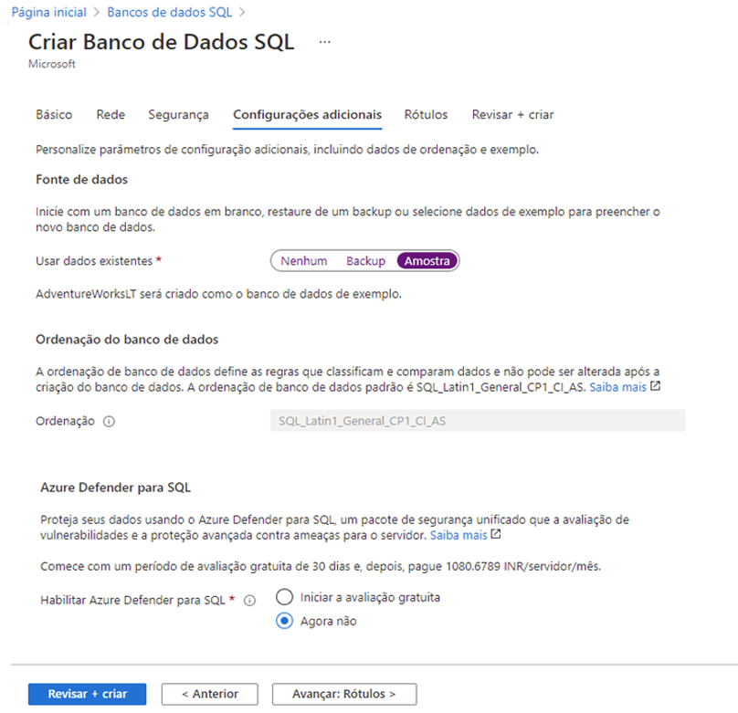
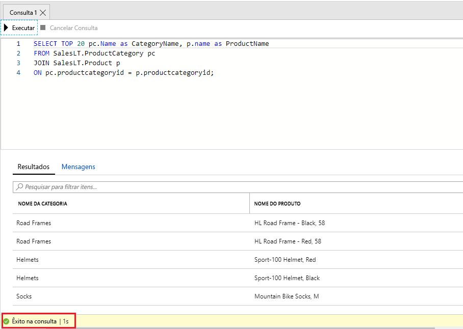

---
wts:
    title: '06 – Criar um banco de dados SQL (5 min)'
    module: 'Módulo 02 – Principais serviços do Azure (cargas de trabalho)'
---

# 06 – Criar um banco de dados SQL

Neste passo a passo, vamos criar um banco de dados SQL no Azure e depois consultar os dados nesse banco de dados.

# Tarefa 1: Criar o banco de dados (5 min)

Nesta tarefa, criaremos um banco de dados SQL baseado no banco de dados de amostra AdventureWorksLT. 

1. Entre no portal do Azure em [**https://portal.azure.com**](https://portal.azure.com).

2. Na folha **Todos os serviços**, procure e selecione **Bancos de dados SQL** e, em seguida, clique em **+ Adicionar, + Criar ou + Novo**. 

3. Na guia **Básico**, preencha essas informações.  

    | Configuração | Valor | 
    | --- | --- |
    | Assinatura | **escolha sua assinatura** |
    | Grupo de recursos | **myRGDb** (criar novo) |
    | Nome do banco de dados| **db1** | 
    | | |

3. Ao lado da lista suspensa **Servidor**, clique em **Criar novo** e insira essas informações (substitua **xxxx** no nome do servidor por letras e dígitos de forma que o nome seja globalmente exclusivo). Clique em **OK** quando terminar.

    | Configuração | Valor | 
    | --- | --- |
    | Nome do servidor | **sqlserverxxxx** (deve ser exclusivo) | 
    | Logon de administrador do servidor | **sqluser** |
    | Senha | **Pa$$w0rd1234** |
    | Local | **(EUA) Leste dos EUA** |
    | Permitir que os serviços do Azure acessem o servidor| ***Marque a caixa de seleção*** |
    | | |

   

4. Vá para a guia **Rede** e defina as configurações a seguir (deixe os outros campos com os valores padrão) 

    | Configuração | Valor | 
    | --- | --- |
    | Método de conectividade | **Ponto de extremidade público** |    
    | Permitir que serviços e recursos do Azure acessem este servidor | **Sim** |
    | Adicionar endereço IP atual do cliente | **Não** |
    | | |
    
   

5. Vá para a guia **Configurações adicionais**. Usaremos o banco de dados de amostra AdventureWorksLT.

    | Configuração | Valor | 
    | --- | --- |
    | Usar dados existentes | **Amostra** |
    | Ordenação | ***usar padrão*** |
    | Habilitar o Azure Defender para SQL | **Agora não** |
    | | |

    

6. Clique em **Revisar + criar** e selecione **Criar** para implantar e provisionar o grupo de recursos, o servidor e o banco de dados. Pode demorar aprox. 2 a 5 minutos para implantar.

7. Vá para a guia de recursos para localizar o banco de dados SQL que você criou. Você pode precisar atualizar.

# Tarefa 2: Testar o banco de dados.

Nesta tarefa, vamos configurar o SQL Server e executar uma consulta SQL. 

1. Na folha **Todos os serviços**, procure e selecione **Bancos de Dados SQL** e verifique se o novo banco de dados foi criado. Pode ser necessário **Atualizar** a página.

    

2. Clique na entrada **db1** que representa o banco de dados SQL que você criou e, em seguida, clique em **Editor de consultas (pré-visualização)**.

3. Faça logon como **sqluser** com a senha **Pa$$w0rd1234**.

4. Você não conseguirá fazer logon. Leia o erro com atenção e anote o endereço IP que precisa receber permissão para atravessar o firewall. 

    

5. Na folha **db1**, clique em **Visão geral**. 

    

6. Na folha **Visão geral** do SQL Server, clique em **Definir firewall do servidor**.

7. Clique em **Adicionar IP do cliente** (barra de menu superior) para adicionar o endereço IP mencionado no erro. Certifique-se de **Salvar** suas alterações. 

    

8. Volte para o banco de dados SQL e para a página de logon do **Editor de Consultas (pré-visualização)**. Tente fazer logon novamente como **sqluser** com a senha **Pa$$w0rd1234**. Desta vez, você deve conseguir. Observe que pode demorar alguns minutos para que a nova regra de firewall seja implantada. 

9. Após você fazer logon com êxito, o painel de consultas será exibido. Insira a consulta a seguir no painel do editor.

    ```SQL
    SELECT TOP 20 pc.Name as CategoryName, p.name as ProductName
    FROM SalesLT.ProductCategory pc
    JOIN SalesLT.Product p
    ON pc.productcategoryid = p.productcategoryid;
    ```

    

10. Clique em **Executar** e examine os resultados da consulta no painel **Resultados**. A consulta deve ser executada com êxito.

    

Parabéns! Você criou um banco de dados SQL no Azure e consultou com êxito os dados contidos nele.

**Observação**: Para evitar custos adicionais, você pode remover este grupo de recursos. Procure grupos de recursos, clique em seu grupo de recursos e, em seguida, clique em **Excluir grupo de recursos**. Verifique o nome do grupo de recursos e clique em **Excluir**. Monitore as **Notificações** para ver como a exclusão está ocorrendo.
