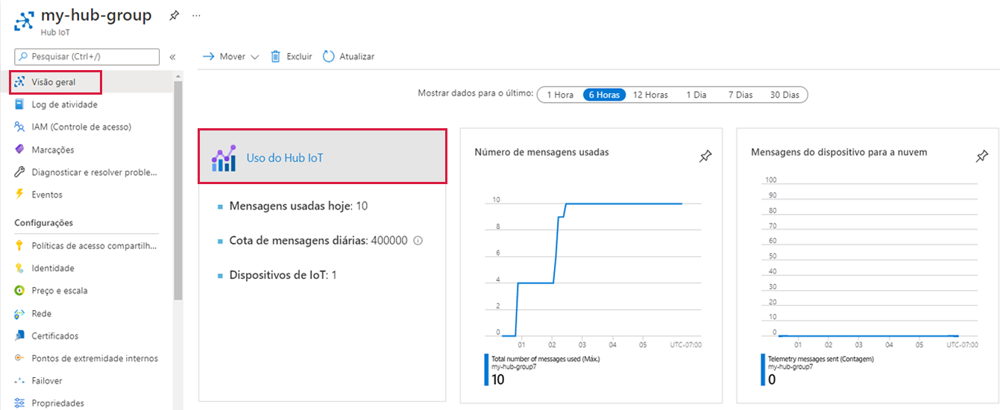

---
wts:
    title: '07 – Implementar um Hub IoT do Azure (10 min)'
    module: 'Módulo 03: Descrever as principais soluções e ferramentas de gerenciamento'
---
# 07 – Implementar um Hub IoT do Azure

Neste passo a passo, vamos configurar um novo Hub IoT do Azure no portal do Azure e, em seguida, autenticar uma conexão a um dispositivo IoT usando o simulador de dispositivo Raspberry Pi online. Os dados e mensagens do sensor são transmitidos do simulador Raspberry Pi para o Hub IoT do Azure, e você visualiza as métricas para a atividade de mensagens no portal do Azure.

# Tarefa 1: Criar um hub IoT (10 min)

Nesta tarefa, criaremos um hub IoT. 

1. Entre no [portal do Azure](https://portal.azure.com).

2. Na folha **Todos os serviços**, procure e selecione **Hub IoT** e, em seguida, clique em **+ Adicionar, + Criar ou + Novo**.

3. Na guia **Básico** da folha **Hub IoT**, preencha os campos com os seguintes detalhes (substitua **xxxx** no nome da conta de armazenamento por letras e dígitos de forma que o nome seja globalmente exclusivo):

    | Configurações | Valor |
    |--|--|
    | Assinatura | **escolha sua assinatura** |
    | Grupo de Recursos |  **myRGIoT** (criar novo)|
    | Região | **Leste dos EUA** |
    | Nome do hub IoT | **my-hub-groupxxxx** |
    | | |

    **Observação** - Lembre-se de alterar o **xxxx** para que tenha um **Nome do Hub IoT ** exclusivo.

4. Vá para a guia **Gerenciamento** e use a lista suspensa para definir o **Preço e o nível de escala** como **S1: camada Standard**.

5. Clique no botão **Revisar + criar**.

6. Clique no botão **Criar** para começar a criar sua nova instância do Hub IoT do Azure.

7. Aguarde até que a instância do Hub IoT do Azure seja implantada. 

# Tarefa 2: Adicionar um dispositivo IoT

Nesta tarefa, adicionaremos um dispositivo IoT ao Hub IoT. 

1. Quando a implantação for concluída, clique em **Ir para o recurso** na folha de implantação. Como alternativa, na folha **Todos os serviços**, procure e selecione **Hub do IoT** e localize sua nova instância do Hub IoT

	

2. Para adicionar um novo dispositivo IoT, role para baixo até a seção **Explorers** e clique em **Dispositivos IoT**. Em seguida, clique em **+ Novo**.

	

3. Forneça um nome para seu novo dispositivo IoT, **myRaspberryPi**, e clique no botão **Salvar**. Isso criará uma nova identidade do dispositivo IoT em seu Hub IoT do Azure.

4. Caso não veja seu novo dispositivo, **Atualize** a página Dispositivos IoT. 

5. Selecione **myRaspberryPi** e copie o valor da **Cadeia de conexão primária**. Você usará essa chave na próxima tarefa para autenticar uma conexão com o simulador Raspberry Pi.

	

# Tarefa 3: Testar o dispositivo usando o Simulador Raspberry Pi

Nesta tarefa, testaremos nosso dispositivo usando o Simulador Raspberry Pi. 

1. Abra uma nova guia no navegador Web e navegue até o [simulador Raspberry Pi online](https://azure-samples.github.io/raspberry-pi-web-simulator/#Getstarted). 

2. Leia sobre o simulador Raspberry Pi. Se houver um pop-up de visão geral, selecione "**X**" para fechar a janela.

3. Na área de código, lado direito, localize a linha com 'const connectionString ='. Substitua-a pela cadeia de conexão que você copiou do portal do Azure. Observe que a cadeia de conexão inclui as entradas DeviceId (**myRaspberryPi**) e SharedAccessKey.

	

4. Clique em **Executar** (abaixo da área de código) para executar o aplicativo. A saída do console deve mostrar os dados do sensor e as mensagens enviadas do simulador Raspberry Pi para o Hub IoT do Azure. Dados e mensagens são enviados sempre que o LED do simulador Raspberry Pi pisca. 

	

5. Clique em **Parar** para parar de enviar dados.

6. Volte para o portal do Azure e seu Hub IoT.

7. Alterne a folha **Visão geral** do Hub IoT e role para baixo até as informações de **Uso do Hub IoT**.

	

Parabéns! Você configurou o Hub IoT do Azure para coletar dados do sensor de um dispositivo IoT.

**Observação**: Para evitar custos adicionais, você pode remover este grupo de recursos. Procure grupos de recursos, clique em seu grupo de recursos e, em seguida, clique em **Excluir grupo de recursos**. Verifique o nome do grupo de recursos e clique em **Excluir**. Monitore as **Notificações** para ver como a exclusão está ocorrendo.
