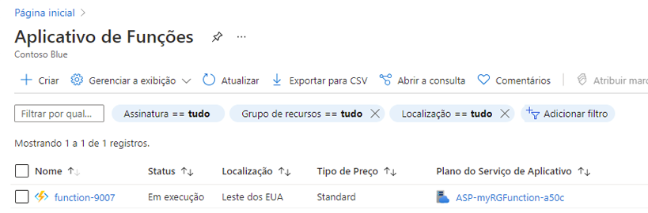
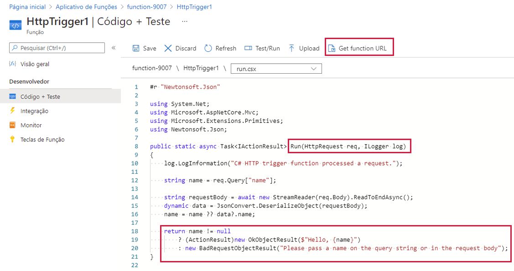
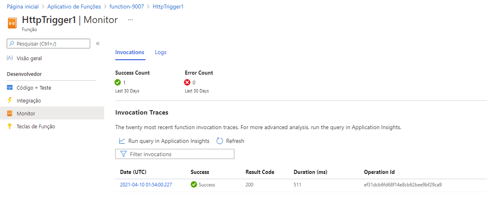

---
wts:
    title: '08 – Implementar Funções do Azure (5 min)'
    module: 'Módulo 03: Descrever as principais soluções e ferramentas de gerenciamento'
---
# 08 – Implementar Funções do Azure

Neste passo a passo, criaremos um aplicativo de funções para exibir uma mensagem Olá quando houver uma solicitação HTTP. 

# Tarefa 1: Criar um aplicativo de funções (5 min)

Nesta tarefa, criaremos um aplicativo de funções.

1. Entre no [portal do Azure](https://portal.azure.com).

1. Na caixa de texto **Pesquisar recursos, serviços e documentos** na parte superior do portal, pesquise e selecione **Aplicativo de funções** e, na folha **Aplicativo de funções**, clique em **+ Adicionar, + Criar ou + Novo**.

1. Na guia **Básico** da folha do **Aplicativo de Funções**, especifique as seguintes configurações (substitua **xxxx** no nome da função por letras e dígitos de forma que o nome seja globalmente exclusivo e mantenha todas as outras configurações com seus valores padrão): 

    | Configurações | Valor |
    | -- | --|
    | Assinatura | o nome da sua assinatura do Azure |
    | Grupo de recursos | o nome de um novo grupo de recursos **myRGFunction** |
    | Nome do aplicativo de funções | **function-xxxx** |
    | Publicar | **Código** |
    | Pilha de runtime | **NET** |
    | Versão | **3.1** |
    | Região | **Leste dos EUA** |
    | | |

    **Observação** - Lembre-se de alterar o **xxxx** para que tenha um **Nome de aplicativo de funções** exclusivo

1. Clique em **Revisar + Criar** e, após a validação bem-sucedida, clique em **Criar** para começar a provisionar e implantar seu novo Aplicativo de Funções do Azure.

1. Aguarde a notificação de que o recurso foi criado.

1. Navegue de volta para a folha **Aplicativo de Funções**, clique em **Atualizar** e verifique se o aplicativo de funções recém-criado tem o status **Em execução**. 

    

# Tarefa 2: Criar uma função disparada por HTTP e testar

Nesta tarefa, usaremos a função Webhook + API para exibir uma mensagem quando houver uma solicitação HTTP. 

1. Na folha **Aplicativo de Funções**, clique no aplicativo de funções recém-criado. 

1. Na folha do aplicativo de funções, na seção **Funções**, clique em **Funções** e em **+ Adicionar**.

    

1. Na seção **Selecionar um modelo** da folha **Adicionar função**, clique em **Gatilho HTTP**; na seção **Detalhes do modelo**, aceite os padrões e, em seguida, clique em **Adicionar**.

1. Na folha **HttpTrigger1**, na seção **Desenvolvedor**, clique em **Código + Teste**. 

1. Na folha **HttpTrigger1 \| Código + Teste**, analise o código gerado automaticamente e observe que o código foi projetado para executar uma solicitação HTTP e registrar informações. Além disso, observe que a função retorna uma mensagem Olá com um nome. 

    

1. Clique em **Obter URL de função** na seção superior do editor de função. 

1. Certifique-se de que o valor na lista suspensa **Chave** esteja definido como **padrão** e clique em **Copiar** para copiar o URL da função. 

    

1. Abra uma nova guia do navegador e cole o URL da função copiado na barra de endereços do seu navegador Web. Quando a página for solicitada, a função será executada. Observe a mensagem retornada informando que a função requer um nome no corpo da solicitação.

    

1. Acrescente **&name=*yourname*** ao final do URL.

    **Observação**: Substitua ***yourname*** pelo seu nome. Por exemplo, se seu nome for Cindy, o URL final será semelhante ao seguinte `https://azfuncxxx.azurewebsites.net/api/HttpTrigger1?code=X9xx9999xXXXXX9x9xxxXX==&name=cindy`

    

1. Quando sua função é executada, cada chamada é rastreada. Para visualizar os rastreamentos no portal do Azure, retorne à folha **HttpTrigger1 \| Código + Teste** e clique em **Monitorar**.

     

Parabéns! Você criou um aplicativo de funções para exibir uma mensagem Olá quando houver uma solicitação HTTP. 

**Observação**: Para evitar custos adicionais, você pode remover este grupo de recursos. Procure grupos de recursos, clique em seu grupo de recursos e, em seguida, clique em **Excluir grupo de recursos**. Verifique o nome do grupo de recursos e clique em **Excluir**. Monitore as **Notificações** para ver como a exclusão está ocorrendo.
