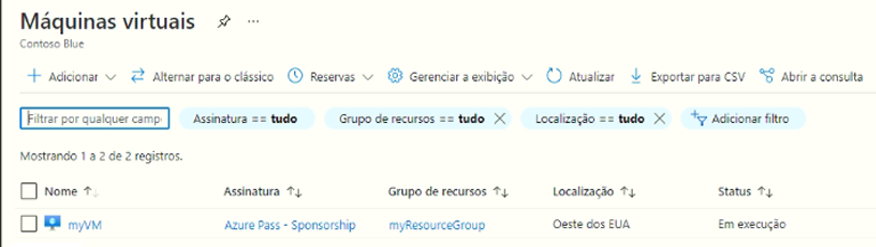

---
wts:
    title: '09 – Criar uma VM com um modelo (10 min)'
    module: 'Módulo 03: Descrever as principais soluções e ferramentas de gerenciamento'
---
# 09 – Criar uma VM com um modelo

Neste passo a passo, implantaremos uma máquina virtual com um modelo de início rápido e examinaremos os recursos de monitoramento.

# Tarefa 1: Explorar a galeria e localize um modelo (10 min)

Nesta tarefa, navegaremos na galeria de início rápido do Azure e implantaremos um modelo que cria uma máquina virtual. 

1. Em um navegador, acesse a [Galeria de modelos de início rápido do Azure](https://azure.microsoft.com/resources/templates?azure-portal=true). Na galeria, você encontrará vários modelos populares e atualizados recentemente. Esses modelos automatizam a implantação de recursos do Azure, incluindo a instalação de pacotes de software populares.

2. Navegue pelos diversos tipos de modelos disponíveis. 

    **Observação**: Há modelos que são do seu interesse?

3. Procure ou acesse diretamente o modelo [Implantar uma máquina virtual](https://azure.microsoft.com/resources/templates/101-vm-simple-windows?azure-portal=true).

    **Observação**: O botão **Implantar no Azure** permite que você implante o modelo por meio do portal do Azure. Durante essa implantação, será solicitado apenas um pequeno conjunto de parâmetros de configuração. 

4. Clique no botão **Implantar no Azure**. A sessão do seu navegador será redirecionada automaticamente para o [portal do Azure](http://portal.azure.com/).

5. Se solicitado, entre na assinatura do Azure que deseja usar neste laboratório.

6. Clique em **Editar modelo**. O formato de modelo do Resource Manager usa o formato JSON. Revise os parâmetros e variáveis.  Em seguida, localize o parâmetro para o nome da máquina virtual. Altere o nome para **myVMTemplate**. **Salve** suas alterações. Você retornará à folha **Implantação personalizada** no portal do Azure.

    

7. Na folha **Implementação personalizada**, configure os parâmetros exigidos pelo modelo (substitua ***xxxx*** no prefixo da etiqueta de DNS por letras e dígitos de forma que a etiqueta seja globalmente exclusiva). Mantenha os padrões para todo o resto. 

    | Configuração| Valor|
    |----|----|
    | Assinatura | **Escolha sua assinatura**|
    | Grupo de recursos | **myRGTemplate** (criar novo) |
    | Local | **(EUA) Leste dos EUA** |
    | Nome de usuário do administrador | **azureuser** |
    | Senha do administrador | **Pa$$w0rd1234** |
    | Prefixo da etiqueta de DNS | **myvmtemplate*xxxx*** |
    | Versão do SO Windows | **2019-Datacenter** |
    | | |
    
    ** Observação: Não há custos associados a este modelo.

8. Clique em **Revisar + Criar**.

9. Assim que a validação for aprovada, clique no botão **Criar**. Pode levar de cinco a sete minutos para implantar a máquina virtual. 

# Tarefa 2: Verificar e monitorar a implantação de sua máquina virtual

Nesta tarefa, vamos verificar a máquina virtual implantada corretamente. 

1. Na folha **Todos os serviços**, procure e selecione **Máquinas virtuais**.

2. Certifique-se de que sua nova máquina virtual foi criada. 

    

3. Selecione sua máquina virtual e, no painel **Visão geral**, role para baixo para visualizar os dados de monitoramento.

    **Observação**: O período de monitoramento pode ser ajustado de uma hora a 30 dias.

4. Revise os diferentes gráficos fornecidos, incluindo **CPU (média)**, **Rede (total)** e **Bytes de disco (total)**. 

    

5. Clique em qualquer gráfico. Observe que você pode **Adicionar métrica** e alterar o tipo de gráfico.

6. Retorne à folha **Visão geral**.

7. Clique no **Log de atividades** (painel esquerdo). Os logs de atividades registram eventos como criação ou modificação de recursos. 

8. Clique em **Adicionar filtro** e experimente pesquisar diferentes tipos de eventos e operações. 

    

**Observação**: Para evitar custos adicionais, você pode remover este grupo de recursos. Procure grupos de recursos, clique em seu grupo de recursos e, em seguida, clique em **Excluir grupo de recursos**. Verifique o nome do grupo de recursos e clique em **Excluir**. Monitore as **Notificações** para ver como a exclusão está ocorrendo.
