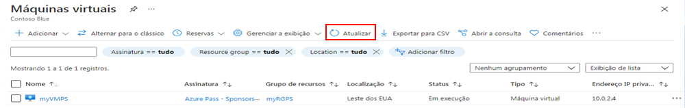
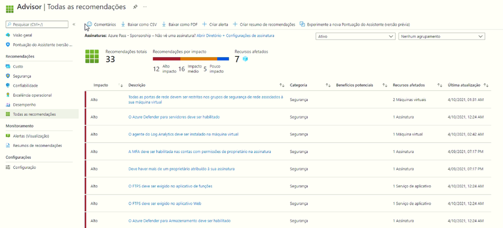

---
wts:
    title: '10- Criar uma VM com o PowerShell (10 min)'
    module: 'Módulo 03: Descrever as principais soluções e ferramentas de gerenciamento'
---
# 10 – Criar uma VM com o PowerShell

Neste passo a passo, vamos configurar o Cloud Shell, usar o módulo Azure PowerShell para criar um grupo de recursos e máquina virtual e analisar as recomendações do Assistente do Azure. 

# Tarefa 1: Configurar o Cloud Shell (10 min)

Nesta tarefa, vamos configurar o Cloud Shell. 

1. Entre no [portal do Azure](https://portal.azure.com).

2. No portal do Azure, abra o **Azure Cloud Shell** clicando no ícone no canto superior direito do portal do Azure.

    

3. Se você já usou o Cloud Shell, prossiga para a próxima tarefa. 

4. Quando solicitado a selecionar **Bash** ou **PowerShell**, selecione **PowerShell**.

5. Quando solicitado, clique em **Criar armazenamento** e aguarde a inicialização do Azure Cloud Shell. 

# Tarefa 2: Criar um grupo de recursos e uma máquina virtual

Nesta tarefa, usaremos o PowerShell para criar um grupo de recursos e uma máquina virtual.  

1. Certifique-se de que o **PowerShell** esteja selecionado no menu suspenso superior esquerdo do painel do Cloud Shell.

2. Na sessão do PowerShell, no painel do Cloud Shell, crie um novo grupo de recursos. 

    ```PowerShell
    New-AzResourceGroup -Name myRGPS -Location EastUS
    ```

3. Verifique seu novo grupo de recursos. 

    ```PowerShell
    Get-AzResourceGroup | Format-Table
    ```

4. Crie uma máquina virtual. Quando solicitado, forneça o nome de usuário (**azureuser**) e a senha (**Pa$$w0rd1234**) que serão configurados como a conta de Administrador local nessas máquinas virtuais. Certifique-se de incluir os caracteres de marcação (`) no final de cada linha, exceto a última (não deve haver nenhum caractere de marcação se você digitar o comando inteiro em uma única linha).

    ```PowerShell
    New-AzVm `
    -ResourceGroupName "myRGPS" `
    -Name "myVMPS" `
    -Location "East US" `
    -VirtualNetworkName "myVnetPS" `
    -SubnetName "mySubnetPS" `
    -SecurityGroupName "myNSGPS" `
    -PublicIpAddressName "myPublicIpPS"
    ```
** Aguarde a implantação da VM antes de fechar o PowerShell

5. Feche o painel do Cloud Shell de sessão do PowerShell.

6. No portal do Azure, procure **Máquinas virtuais** e verifique se o **myVMPS** está em execução. Isso pode levar alguns minutos.

    

7. Acesse a nova máquina virtual e analise a Visão geral e as configurações de rede para verificar se suas informações foram implantadas corretamente. 

# Tarefa 3: Executar comandos no Cloud Shell

Nesta tarefa, praticaremos a execução de comandos do PowerShell no Cloud Shell. 

1. No portal do Azure, abra o **Azure Cloud Shell** clicando no ícone no canto superior direito do portal do Azure.

2. Certifique-se de que o **PowerShell** esteja selecionado no menu suspenso superior esquerdo do painel do Cloud Shell.

3. Recupere informações sobre sua máquina virtual, incluindo nome, grupo de recursos, localização e status. Observe que o PowerState está **em execução**.

    ```PowerShell
    Get-AzVM -name myVMPS -status | Format-Table -autosize
    ```

4. Pare a máquina virtual. Quando solicitado, confirme (Sim) para a ação. 

    ```PowerShell
    Stop-AzVM -ResourceGroupName myRGPS -Name myVMPS
    ```

5. Verifique o estado da sua máquina virtual. O PowerState agora deve ser **desalocado**. Você também pode verificar o status da máquina virtual no portal. 

    ```PowerShell
    Get-AzVM -name myVMPS -status | Format-Table -autosize
    ```

# Tarefa 4: Analisar recomendações do Assistente do Azure

**Observação:** Esta mesma tarefa está no laboratório Criar uma VM com a CLI do Azure. 

Nesta tarefa, revisaremos as recomendações do Assistente do Azure para nossa máquina virtual. 

1. Na folha **Todos os serviços**, procure e selecione **Assistente**. 

2. Na folha **Assistente**, selecione **Visão geral**. As recomendações de aviso são agrupadas por Alta disponibilidade, Segurança, Desempenho e Custo. 

    

3. Selecione **Todas as recomendações** e reserve um tempo para ver cada recomendação e as ações sugeridas. 

    **Observação:** Dependendo de seus recursos, suas recomendações serão diferentes. 

    

4. Observe que você pode baixar as recomendações como um arquivo CSV ou PDF. 

5. E também pode criar alertas. 

6. Se você tiver tempo, continue experimentando o Azure PowerShell. 

Parabéns! Você configurou o Cloud Shell, criou uma máquina virtual usando o PowerShell, praticou com comandos do PowerShell e viu as recomendações do Advisor.

**Observação**: Para evitar custos adicionais, você pode remover este grupo de recursos. Procure grupos de recursos, clique em seu grupo de recursos e, em seguida, clique em **Excluir grupo de recursos**. Verifique o nome do grupo de recursos e clique em **Excluir**. Monitore as **Notificações** para ver como a exclusão está ocorrendo.
