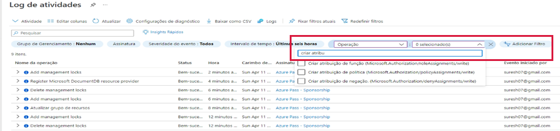

---
wts:
    title: '14 – Gerenciar acesso com o RBAC (5 min)'
    module: 'Módulo 05: Descreva os recursos de identidade, governança, privacidade e conformidade'
---
# 14 – Gerenciar acesso com o RBAC

Neste passo a passo, vamos atribuir funções e visualizar logs de atividades. 

# Tarefa 1: Ver e atribuir funções (5 min)

Nesta tarefa, atribuiremos a função de colaborador da máquina virtual. 

1. Entre no [portal do Azure](https://portal.azure.com).

2. Na folha **Todos os serviços**, procure e selecione **Grupo de recursos** e, em seguida, clique em **+ Adicionar, + Criar ou + Novo**.

3. Criar um grupo de recursos. Clique em **Criar** quando terminar. 

    | Configuração | Valor |
    | -- | -- |
    | Assinatura | **escolha sua assinatura** |
    | Grupo de recursos | **myRGRBAC** |
    | Região | **(EUA) Leste dos EUA** |
    | | |

4. Clique em **Revisar + criar** e, em seguida, clique em **Criar**.

5. **Atualize** a página do grupo de recursos e clique na entrada que representa o grupo de recursos recém-criado.

6. Clique na folha **Controle de acesso (IAM)** e alterne para a guia **Funções**. Percorra o grande número de definições de funções disponíveis. Use os ícones informativos para ter uma ideia das permissões de cada função. Observe que também há informações sobre o número de usuários e grupos atribuídos a cada função.

    

7. Alterne para a guia **Atribuições de função** da folha **myRGRBAC – Controle de acesso (IAM)**, clique em **+ Adicionar** e, em seguida, clique em **Adicionar atribuição de função**. Atribua a função de colaborador da máquina virtual à sua conta de usuário e clique em **Salvar**. 

    | Configuração | Valor |
    | -- | -- |
    | Função | **Colaborador de máquina virtual** |
    | Atribuir acesso a | **usuário, grupo ou entidade de serviço** |
    | Selecione | sua conta de usuário |
    | | |

    **Observação:** A função de colaborador da máquina virtual permite que você gerencie máquinas virtuais, mas não acesse seu sistema operacional ou gerencie a rede virtual e a conta de armazenamento às quais estão conectadas.

    

8. **Atualize** a página de atribuições de função e certifique-se de que agora você esteja listado como um colaborador da máquina virtual. 

    **Observação**: Na verdade, essa atribuição não concede a você nenhum privilégio adicional, pois sua conta já tem a função de Proprietário, que inclui todos os privilégios associados à função de Colaborador.

# Tarefa 2: Monitorar atribuições de funções e remover uma função

Nesta tarefa, veremos o log de atividades para verificar a atribuição de função e, em seguida, removeremos a função. 

1. Na folha do grupo de recursos myRGRBAC, clique em **Log de atividades**.

2. Clique em **Adicionar filtro**, selecione **Operação** e, em seguida, **Criar atribuição de função**.

    

3. Verifique se o log de atividades mostra sua atribuição de função. 

    **Observação**: Você consegue descobrir como remover sua atribuição de função?

Parabéns! Você atribuiu funções e visualizou logs de atividades. 

**Observação**: Para evitar custos adicionais, você pode remover este grupo de recursos. Procure grupos de recursos, clique em seu grupo de recursos e, em seguida, clique em **Excluir grupo de recursos**. Verifique o nome do grupo de recursos e clique em **Excluir**. Monitore as **Notificações** para ver como a exclusão está ocorrendo.

