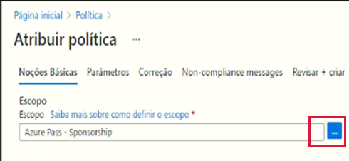
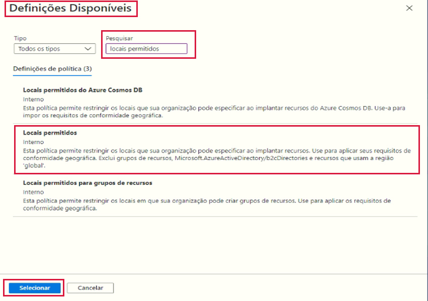
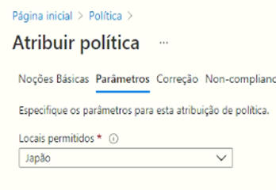
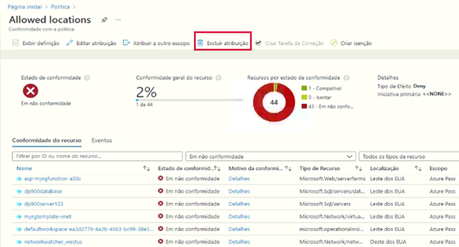

---
wts:
    title: '17 – Criar uma Azure Policy (10 min)'
    module: 'Módulo 05: Descreva os recursos de identidade, governança, privacidade e conformidade'
---
# 17 – Criar uma Azure Policy

Neste passo a passo, criaremos uma Azure Policy para restringir a implantação dos recursos do Azure em um local específico.

# Tarefa 1: Criar uma atribuição de política (10 min)

Nesta tarefa, vamos configurar a política de localização permitida e atribuí-la à nossa assinatura. 

1. Entre no [portal do Azure](https://portal.azure.com).

2. Na folha **Todos os serviços**, procure e selecione **Política**, na seção **Criação**, clique em **Definições**.  Reserve um momento para revisar a lista de definições de política integradas. Por exemplo, na lista suspensa **Categoria**, selecione apenas **Calcular**. Observe que a definição de **SKUs de máquina virtual permitidos** possibilita especificar um conjunto de SKUs de máquina virtual que pode ser implantado pela sua organização.

3. Retorne à página **Política**, na seção **Criação**, clique em **Atribuições**. Uma atribuição é uma política atribuída para ocorrer dentro de um escopo específico. Por exemplo, uma definição pode ser atribuída ao escopo da assinatura. 

4. Clique em **Atribuir política** na parte superior da página **Política – Atribuições**.

5. Na página **Atribuir política**, selecione o seletor de Escopo clicando nas reticências.

    

6. Certifique-se de que sua assinatura esteja selecionada. Seu nome de assinatura pode ser diferente. Observe que como opção você pode definir o escopo da política para um grupo de recursos. Deixe os padrões e clique em **Selecionar**. 

    **Observação**: Um escopo determina a quais recursos ou agrupamento de recursos a atribuição de política se aplica. Em nosso caso, poderíamos atribuir essa política a um grupo de recursos específico, no entanto, optamos por atribuir a política no nível de assinatura. Esteja ciente de que os recursos podem ser excluídos com base na configuração do escopo. As exclusões são opcionais.

    

7. Selecione o botão de reticências de **Definição de política**. Na caixa **Pesquisar**, digite **local** e clique na definição **Locais permitidos** e, a seguir, clique em **Selecionar**.

    **Observação**: Esta definição de política de **Locais permitidos** especificará um local no qual todos os recursos devem ser implantados. Se um local diferente for escolhido, a implantação não será permitida. Para obter mais informações, consulte a página [Amostras de Azure Policy](https://docs.microsoft.com/pt-br/azure/governance/policy/samples/index).

   

8.  No painel **Atribuir política**, alterne para a guia **Parâmetros**, clique na seta no final da caixa **Locais permitidos** e, na lista subsequente, escolha **Oeste do Japão**. Deixe todos os outros valores como estão e clique em **Revisar + criar** e, em seguida, em **Criar**.

    

9. A atribuição de política de **Locais permitidos** agora está listada no painel **Política – Atribuições** e está em vigor, impondo a política no nível de escopo que especificamos (nível de assinatura).

# Tarefa 2: Testar política de localização permitida

Nesta tarefa, testaremos a política de localização permitida. 

1. No portal do Azure, na folha **Todos os serviços**, procure e selecione **Contas de armazenamento** e, em seguida, clique em **+ Adicionar, + Criar ou + Novo**.

2. Configure a conta de armazenamento (substitua **xxxx** no nome da conta de armazenamento por letras e dígitos de forma que o nome seja globalmente exclusivo). Mantenha os padrões para todo o resto. 

    | Configuração | Valor | 
    | --- | --- |
    | Assinatura | **Usar sua assinatura** |
    | Grupo de recursos | **myRGPolicy** (criar novo) |
    | Nome da conta de armazenamento | **storageaccountxxxx** |
    | Local | **(EUA) Leste dos EUA** |
    | | |

3. Clique em **Revisar + criar** e, em seguida, clique em **Criar**. 

4. Você receberá o erro de falha de implantação informando que o recurso não foi permitido pela política, incluindo o nome da política de **Locais permitidos**.

# Tarefa 3: Excluir a atribuição de política

Nesta tarefa, removeremos a atribuição e o teste da política de localização permitida. 

Excluiremos a atribuição de política para garantir que não seremos bloqueados em nenhum trabalho futuro que desejamos fazer.

1. Na folha **Todos os serviços**, procure e selecione **Política** e clique em sua política de **Locais permitidos**.

    **Observação**: Na folha **Política**, você pode visualizar o estado de conformidade das várias políticas atribuídas.

    **Observação**: A política de localização permitida pode mostrar recursos não compatíveis. Nesse caso, esses são recursos criados antes da atribuição de política.

2. Clique em **Excluir atribuição** no menu superior.

   

3. Confirme que deseja excluir a atribuição de política na caixa de diálogo **Excluir atribuição** clicando em **Sim**

4. Tente criar outra conta de armazenamento para garantir que a política não esteja mais em vigor.

    **Observação**: Os cenários comuns em que a política de **Locais permitidos** pode ser útil incluem: 
    - *Rastreamento de custos*: Você pode ter assinaturas diferentes para locais regionais diferentes. A política vai garantir que todos os recursos sejam implantados na região pretendida para ajudar no rastreamento de custos. 
    - *Residência de dados e conformidade de segurança*: Você também pode ter requisitos de residência de dados e criar assinaturas por cliente ou cargas de trabalho específicas e definir que todos os recursos devem ser implantados em um datacenter específico para garantir os requisitos de conformidade de dados e segurança.

Parabéns! Você criou uma Azure Policy para restringir a implantação de recursos do Azure em um datacenter específico.

**Observação**: Para evitar custos adicionais, você pode remover este grupo de recursos. Procure grupos de recursos, clique em seu grupo de recursos e, em seguida, clique em **Excluir grupo de recursos**. Verifique o nome do grupo de recursos e clique em **Excluir**. Monitore as **Notificações** para ver como a exclusão está ocorrendo.
